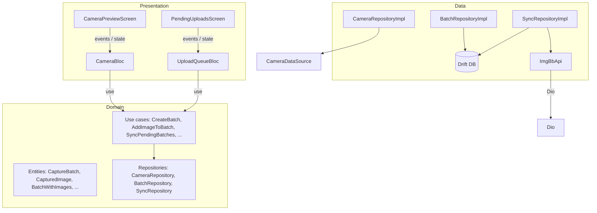
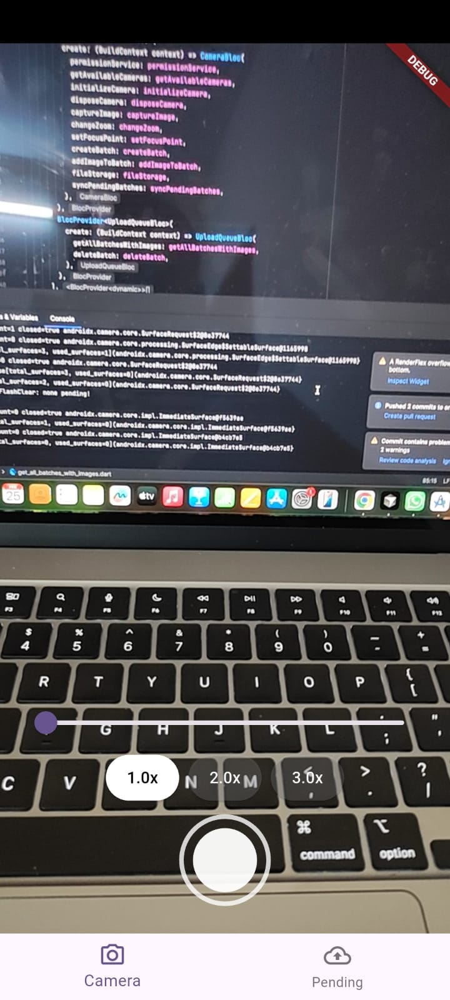
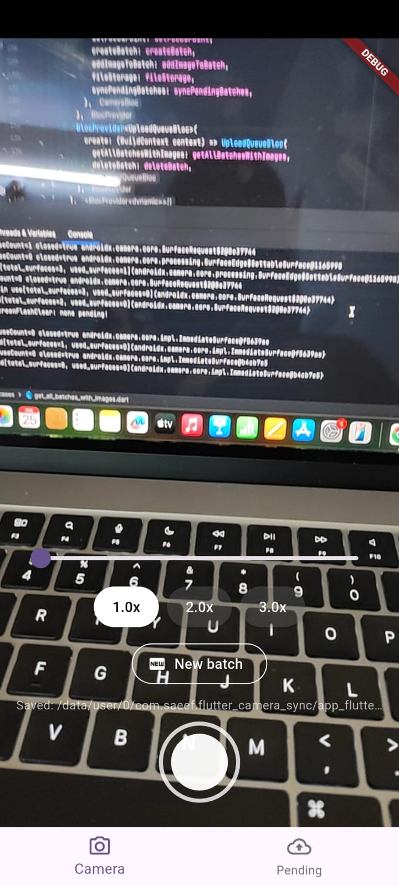
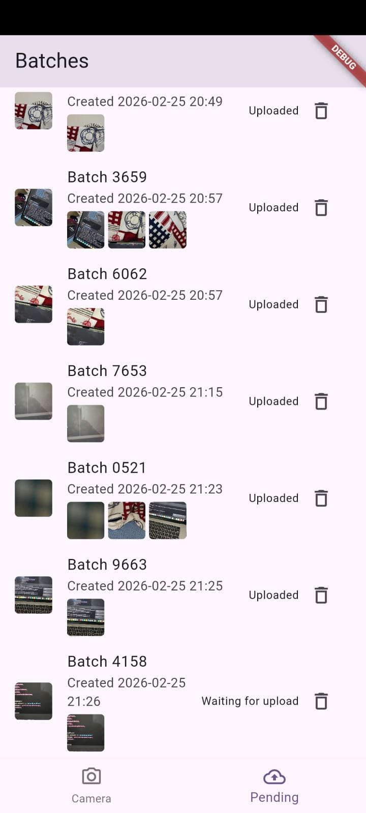
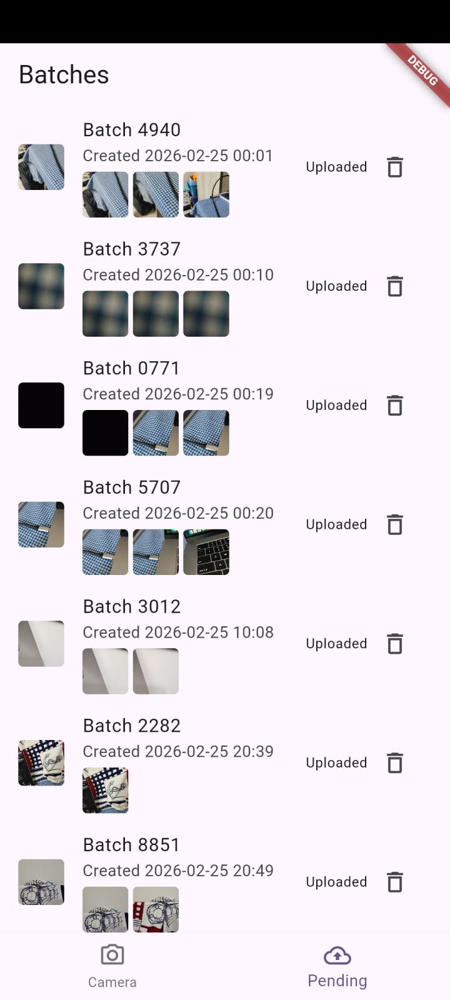
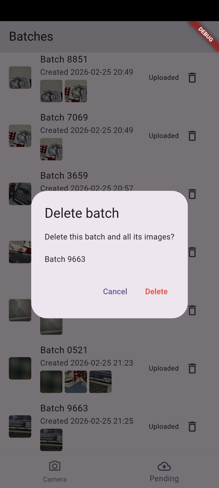

# Flutter Camera Sync – Advanced Camera & Sync Engine

A Flutter app that implements a **custom camera UI** with zoom and tap-to-focus, **batch-based image capture**, and a **resilient sync engine** that uploads images to [imgBB](https://imgbb.com/) via Dio. Built with **Clean Architecture + BLoC**, local SQLite (Drift), and a background worker (Workmanager) for automatic retry when connectivity is restored.

---

## 1. Project Title and Description

- **Title:** Flutter Camera Sync – Advanced Camera & Sync Engine  
- **Business requirement (Task 2: Advanced Camera & Sync Engine):**
  - **Custom Camera UI** — Camera preview screen (`CameraPreviewScreen`).
    - **Zoom:** Pinch-to-zoom, a slider, and rounded preset buttons (0.5x, 1x, …) for available back cameras.
    - **Manual focus:** Tap-to-focus with a visual indicator at the tap point.
  - **Batch management** — Capture multiple batches of images. A **“New batch”** button starts a new batch; subsequent captures attach to the current batch. Show a list of all batches (“Batches” / Pending Uploads screen) with status (pending, uploading, uploaded, failed), image previews, and delete-with-confirmation.
  - **Resilient sync engine:**
    - Background worker (**Workmanager**) runs periodically when the device is connected.
    - If the API call fails (low bandwidth, no internet), images remain in the local queue.
    - Upload is retried automatically once a stable connection is detected, without user intervention.
  - **Feedback:** Full-screen camera, status labels per batch, and immediate or background upload to imgBB.

The flow spans two main screens: **Camera** (preview, capture, new batch) and **Batches** (list with thumbnails, status, delete).

---

## 2. Technical Stack

**Framework / language**

- **Flutter** (Dart 3.8.x)

**State management**

- **BLoC pattern** via:
  - `flutter_bloc`
  - `equatable` – value equality for events and states

**HTTP / API**

- **Dio** – HTTP client; used by the imgBB API layer for multipart/form-data image upload.

**Storage / device features**

- **Drift** (+ `sqlite3_flutter_libs`) – local SQLite for batches and images (file paths, upload status).
- **path**, **path_provider** – file paths and app documents directory for stored images.
- **camera** – device camera capture and preview.
- **permission_handler** – camera permission.
- **connectivity_plus** – network check in the background worker.
- **workmanager** – periodic background task to run sync when connected.

**Utilities**

- **equatable** – clean value equality for BLoC events and state.

---

## 3. Project Structure / Approaches

### Architectural approach

The app follows **Clean Architecture** with a **BLoC presentation layer** and feature-based modules:

- **Presentation layer (Flutter + BLoC)**  
  Screens and BLoC classes; BLoCs call use cases and repository abstractions.
- **Domain layer (pure Dart)**  
  Entities, repository interfaces, and use cases; no Flutter or external packages (except equatable/core types).
- **Data layer (platform integration)**  
  Repository implementations, Drift database, CameraDataSource, ImgBB API (Dio), and local file storage.

High-level flow:



### Main BLoC and flows

- **`CameraBloc`**
  - **Key events**
    - `CameraStarted` – on camera tab load: permissions, init camera, emit `CameraReady` with controller, zoom range, focus support.
    - `CameraStopped` – dispose camera, emit `CameraInitial`.
    - `CameraCapturePressed` – ensure current batch (create if null), capture image, copy to app storage, add to batch, trigger fire-and-forget sync.
    - `CameraNewBatchRequested` – clear `currentBatch` in state so the next capture creates a new batch.
    - `CameraZoomChanged` – update zoom level.
    - `CameraFocusRequested` – set focus at normalized (x, y).
  - **State (`CameraState`)**
    - `CameraInitial`, `CameraLoading`, `CameraFailureState`, `CameraReady` (controller, min/max/current zoom, isZoomSupported, isFocusSupported, focusPoint, currentBatch, lastCapturedImagePath, isCapturing).

- **`UploadQueueBloc`**
  - **Key events**
    - `UploadQueueStarted` – on Batches tab load: load all batches with images.
    - `UploadQueueRefreshed` – reload all batches (e.g. after opening tab or pull-to-refresh).
    - `UploadQueueBatchDeleted` – delete batch and its images, then reload list.
  - **State (`UploadQueueState`)**
    - `UploadQueueInitial`, `UploadQueueLoading`, `UploadQueueEmpty`, `UploadQueueFailureState`, `UploadQueueLoaded(List<BatchWithImages>)`.

### File-level structure

```text
lib/
├── main.dart                          # DI, Workmanager registration, runApp
├── root_shell.dart                    # Tab shell: Camera | Batches
├── background/
│   └── sync_worker.dart               # Workmanager entry, background sync
├── core/
│   ├── db/
│   │   ├── app_database.dart          # Drift schema (Batches, Images)
│   │   └── app_database.g.dart        # Generated
│   ├── error/
│   │   └── failure.dart
│   ├── network/
│   │   ├── dio_client.dart
│   │   └── imgbb/
│   │       ├── imgbb_api.dart
│   │       ├── imgbb_config.dart
│   │       └── imgbb_models.dart
│   ├── result/
│   │   └── result.dart
│   ├── services/
│   │   ├── connectivity_service.dart
│   │   └── permission_service.dart
│   ├── storage/
│   │   └── local_file_storage.dart
│   └── usecase/
│       └── use_case.dart
└── features/
    ├── camera/
    │   ├── domain/
    │   │   ├── entities/
    │   │   ├── repositories/
    │   │   │   └── camera_repository.dart
    │   │   └── usecases/
    │   ├── data/
    │   │   ├── datasources/
    │   │   │   └── camera_data_source.dart
    │   │   └── repositories/
    │   │       └── camera_repository_impl.dart
    │   └── presentation/
    │       ├── bloc/
    │       │   ├── camera_bloc.dart
    │       │   ├── camera_event.dart
    │       │   └── camera_state.dart
    │       └── pages/
    │           └── camera_preview_screen.dart
    └── sync/
        ├── domain/
        │   ├── entities/
        │   │   └── batch_with_images.dart
        │   ├── repositories/
        │   │   ├── batch_repository.dart
        │   │   └── sync_repository.dart
        │   └── usecases/
        ├── data/
        │   ├── mappers/
        │   ├── repositories/
        │   │   ├── batch_repository_impl.dart
        │   │   └── sync_repository_impl.dart
        └── presentation/
            ├── bloc/
            │   ├── upload_queue_bloc.dart
            │   ├── upload_queue_event.dart
            │   └── upload_queue_state.dart
            └── pages/
                └── pending_uploads_screen.dart
```

---

## 4. Generative AI Usage

This project was developed with assistance from generative AI as a **coding partner**, not as a full code generator.

- **Project bootstrapping & structure**: I used AI to discuss and validate the initial project structure (feature folders, BLoC layers, shared widgets) and to cross‑check that the architecture followed common clean/BLoC best practices.
- **Generic UI flows**: For standard UI patterns I asked AI for example patterns and then adapted the code to match my own coding style.
- **Technical implementation guidance**: For more complex pieces (state management wiring, responsiveness), I used AI to get guidelines and API reminders, then implemented and refined the final solution myself, validating that it aligned with Flutter and BLoC best practices.
- **Human review & ownership**: All architectural decisions, implementation details, and final code were reviewed, adjusted, and approved by me before being committed to the repository.


---

## 5. How to Run

### Prerequisites

- Flutter SDK installed and on your `PATH` (SDK ^3.8.1).
- Android emulator, iOS simulator, or a physical device with camera.

### Steps

1. **Clone the repository**

   ```bash
   git clone <https://github.com/SaeefMinhaz/flutter_camera_sync.git>
   cd flutter_camera_sync
   ```

2. **Install dependencies**

   ```bash
   flutter pub get
   ```

3. **Optional: regenerate Drift code** (if you change the database schema)

   ```bash
   dart run build_runner build --delete-conflicting-outputs
   ```

4. **Run the app**

   ```bash
   flutter run
   ```

5. **Optional: imgBB API key** (override default for production)

   ```bash
   flutter run --dart-define=IMGBB_API_KEY=your_key
   ```

6. **Permissions**
   - On **Android**, the app requests **camera** permission at runtime.
   - On **iOS**, camera usage description is configured in `Info.plist`.

7. **Testing**

   ```bash
   flutter test
   ```

---

## 6. Screenshots

Screenshots live under `assets/screenshots/` and illustrate the camera, batch, and sync flow:

- **Camera screen (full-screen preview, zoom, focus, capture)**

  

- **Camera with “New batch” button**

  

- **Batches list (pending / uploading / uploaded, with thumbnails)**

  

- **Uploaded batches**

  

- **Delete batch confirmation dialog**

  

These give a quick visual of the custom camera UI, batch management, and the Batches screen with status and delete flow.
